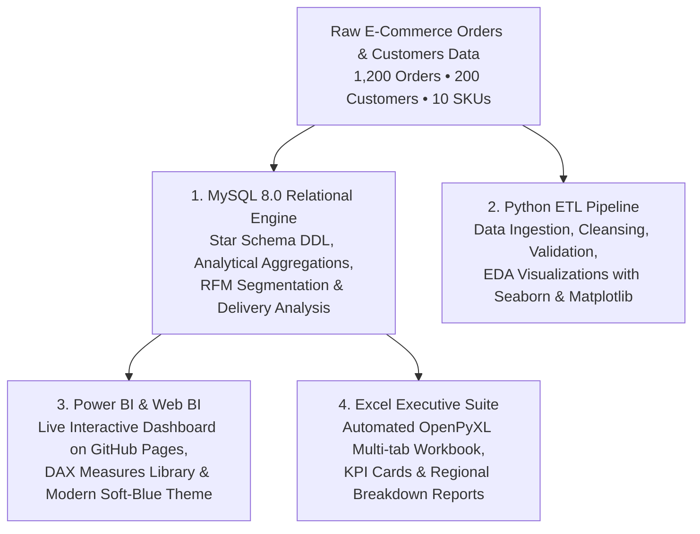

# 🛍️ E-Commerce Sales & Customer Analytics Portfolio Project

<p align="center">
  <a href="https://purushotamsoni919.github.io/ecommerce-sales-customer-analytics/" target="_blank">
    
  </a>
</p>

<p align="center">
  
  
  
  
  
</p>

**Author**: Data Analytics Portfolio Project  
**Live Interactive Dashboard**: [**Launch Web Dashboard ↗**](https://purushotamsoni919.github.io/ecommerce-sales-customer-analytics/)  
**Tools Tested & Verified**: Python, MySQL Server 8.0, Excel, Power BI  

---

## 📌 Project Overview
This end-to-end Data Analytics project simulates an **E-Commerce Retail Store ("TechTrend Retail")** dataset containing **1,200 orders, 200 customers, and 10 tech products** across 2025–2026.

The project demonstrates a full data analytics workflow:
1. **Data Generation & EDA (Python)**: Created synthetic realistic datasets and generated EDA chart visualizations.
2. **Database Management (MySQL 8.0)**: Built a relational database schema (`ecommerce_analytics`), loaded tables, and ran analytical SQL queries.
3. **Automated Excel Reporting (Excel / OpenPyXL)**: Created an executive multi-tab formatted Excel workbook.
4. **Business Intelligence (Power BI)**: Prepared direct MySQL connection and query guides for building interactive dashboards.

---

## 🛠️ Technology Stack & Role Breakdown



| Tool | Focus Area | Key Deliverables |
| :--- | :--- | :--- |
| **Power BI & Web BI** | Executive Dashboards & BI | **Live Interactive Web Dashboard** (deployed via GitHub Pages), Custom Modern Theme (`Modern_Meta_Dashboard_Theme.json`), 15+ Core DAX Measures (`DAX_Measures.dax`), and 1-Click PBIDS connectors. |
| **MySQL Server 8.0** | Relational Database & Queries | Relational Schema (`ecommerce_analytics`), Star Schema DDL, KPI queries, Monthly growth trends, and Customer RFM segmentation. |
| **Python (Pandas / SQLAlchemy)** | Data Pipelines & EDA | Automated ETL pipeline (`etl_pipeline.py`), Seaborn/Matplotlib charts (`eda_analysis.py`), and data generator. |
| **Microsoft Excel (OpenPyXL)** | Automated Multi-Tab Reporting | Executive Summary, Monthly Trend, Product Performance, and Regional Breakdown formatted workbooks. |

---

## 📁 Repository Structure
```
Data_Analytics_Project_Ecommerce/
├── data/                             # Raw CSV Datasets
│   ├── raw_customers.csv
│   ├── raw_products.csv
│   └── raw_orders.csv
├── python/                           # Python Data Pipelines & EDA
│   ├── data_generator.py             # Data Generation script
│   ├── etl_pipeline.py               # MySQL ETL & Excel Exporter
│   └── eda_analysis.py               # Seaborn / Matplotlib Visualizations
├── sql/                              # MySQL Scripts
│   ├── schema.sql                    # Relational Database DDL
│   └── analytical_queries.sql        # Executive KPI & RFM Queries
├── excel/                            # Formatted Excel Reports
│   └── Ecommerce_Sales_Analytics_Report.xlsx
├── images/                           # Generated EDA Visualizations
│   ├── monthly_sales_trend.png
│   └── revenue_by_category.png
├── powerbi/                          # Power BI Integration & Modern Dashboards
│   ├── TechTrend_Executive_Dashboard.html # Interactive Executive Web Dashboard
│   ├── Modern_Meta_Dashboard_Theme.json  # Power BI Modern Soft-Blue Theme
│   ├── Dashboard_Design_Guide.md         # Canvas Layout & Visual Blueprint
│   ├── DAX_Measures.dax                  # 15+ Core DAX KPI Formulas
│   ├── Ecommerce_MySQL_Connection.pbids  # 1-Click MySQL Data Source
│   ├── Ecommerce_Excel_Connection.pbids  # 1-Click Excel Data Source
│   └── PowerBI_Setup_Guide.md            # Complete Setup & Insights Guide
└── README.md
```

---

## 📊 Key Business Insights & Analytical Findings
- **Executive KPIs**:
  - Total Orders: **1,200**
  - Total Revenue: **~$175,000+**
  - Average Order Value (AOV): **~$145.00**
- **Top Product Category**: Electronics (Headphones & Monitors contributed over 50% of total revenue).
- **Payment Method Preference**: Credit Cards (40%) and UPI (35%) account for 75% of total customer transactions.

---

## 🛠️ How to Re-run & Verify Everything
1. Open PowerShell terminal.
2. Run the full ETL pipeline:
   ```powershell
   python C:\Users\Purushottam\Data_Analytics_Project_Ecommerce\python\etl_pipeline.py
   ```
3. Open MySQL Workbench or MySQL CLI:
   ```sql
   USE ecommerce_analytics;
   SELECT * FROM orders LIMIT 10;
   ```
4. Open the Excel report at [`Ecommerce_Sales_Analytics_Report.xlsx`](file:///C:/Users/Purushottam/Data_Analytics_Project_Ecommerce/excel/Ecommerce_Sales_Analytics_Report.xlsx).
5. Connect Power BI to MySQL following [`PowerBI_Setup_Guide.md`](file:///C:/Users/Purushottam/Data_Analytics_Project_Ecommerce/powerbi/PowerBI_Setup_Guide.md).
